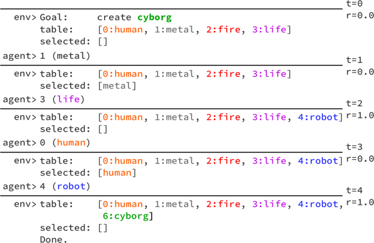
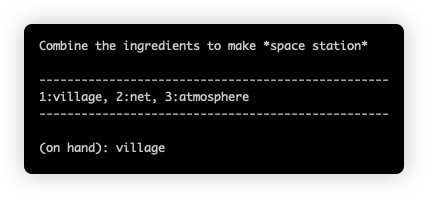

# WordCraft

This is the official Python implementation of [WordCraft: An Environment for Benchmarking Commonsense Agents](https://larel-ws.github.io/assets/pdfs/wordcraft_an_environment_for_benchmarking_commonsense_agents.pdf).



### Citation
If you use this code in your work, please cite our paper:

    @inproceedings{jiang2020wordcraft,
        title={WordCraft: An Environment for Benchmarking Commonsense Agents},
        author={Minqi Jiang and Jelena Luketina and Nantas Nardelli and Pasquale Minervini and Philip H.S. Torr and Shimon Whiteson and Tim Rockt\"{a}schel},
        booktitle={Workshop on Language in Reinforcement Learning (LaRel)},
        year={2020},
        url={https://github.com/minqi/wordcraft},
    }

### Installation
Create a conda environment and install dependencies:
```
conda env create -f environment.yml
conda activate wordcraft
pip install -r requirements.txt
```

Install spaCy model for GloVe embeddings:
```
python -m spacy download en_core_web_lg
```

### Usage
Train a self-attention actor-critic using IMPALA on WordCraft:
```
python -m run \
        --xpid "testing" \
        --env 'wordcraft-multistep-goal-v0' \
        --split by_recipe \
        --train_ratio 0.8 \
        --depths 1 \
        --num_distractors 1 \
        --feature_type glove \
        --discounting 0.99 \
        --reward_clipping none \
        --learning_rate 0.001 \
        --entropy_cost 0.01 \
        --unroll_length 2 \
        --total_steps 3000000 \
        --arch selfattn \
        --num_actors 2 \
        --num_threads 4 \
        --batch_size 128 \
        --test_interval 50000 \
        --num_test_episodes 500 \
        --verbose
```

### The Environment
Create a new WordCraft Gym environment: `env = gym.make('wordcraft-multistep-goal-v0', **kwargs)`. See the table below for a listing of the relevant keyword arguments.

| Argument | Description | default |
| ------ | ------ | ------- |
|data_path|relative path to recipes .json|datasets/alchemy2.json|
|recipe_book_path|absolute path to a serialized [RecipeBook](https://github.com/minqi/wordcraft/blob/master/wordcraft/recipe_book.py) object, useful for ensuring train/test split consistency|None|
|feature_type|How words are represented. One of ['one_hot', 'random', 'glove']|'glove'|
|shuffle_features|Set to True to shuffle GloVe features w.r.t. words|False|
|random_feature_size|Size of random features|300|
|max_depth|Task depth, the number of recipe combinations needed to reach the goal|1|
|split|How to split train and test sets. One of ['by_goal', 'by_recipe']|'by_recipe'|
|train_ratio|Ratio of goals or recipe used for training|1.0|
|num_distractors|Number of irrelevant items present in the starting set|0|
|subgoal_rewards|Set to True to reward creating intermediate entities and penalize, irrelevant entities|True|
|seed|RNG seed, though see N.B. below for ensuring truly reproducible behavior.|None|

### Interactive mode


Try running the environment in interactive mode :)
```
python -m scripts.interactive --depth=1 --num_distractors=1 --max_mix_steps=1 
```
Note `--max_mix_steps` is the total number of recipe attempts allowed. It defaults to the task depth.

#### N.B.
To make environments completely deterministic, you must first fix PYTHONHASHSEED in the shell by executing `export PYTHONHASHSEED="0"`.
You can turn random hashing back on by setting this value back to random: `export PYTHONHASHSEED="random"`.
